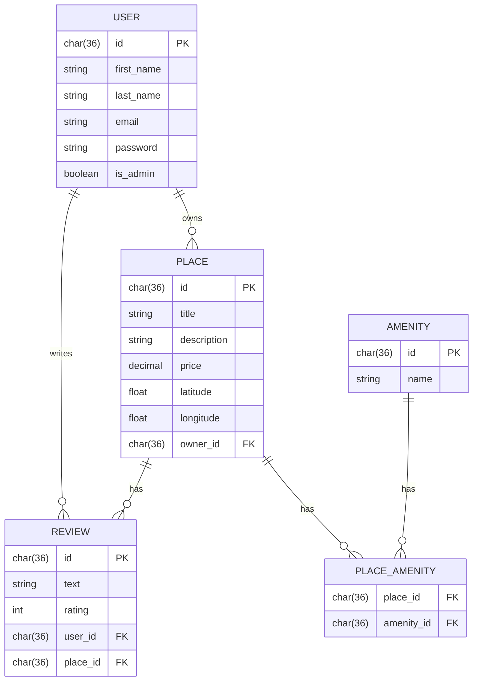

# HBnB Database ER Diagram

```mermaid
erDiagram
    USER ||--o{ PLACE : "owns"
    USER ||--o{ REVIEW : "writes"
    PLACE ||--o{ REVIEW : "has"
    PLACE ||--o{ PLACE_AMENITY : "has"
    AMENITY ||--o{ PLACE_AMENITY : "has"

    USER {
        char(36) id PK
        string first_name
        string last_name
        string email
        string password
        boolean is_admin
    }

    PLACE {
        char(36) id PK
        string title
        string description
        decimal price
        float latitude
        float longitude
        char(36) owner_id FK
    }

    REVIEW {
        char(36) id PK
        string text
        int rating
        char(36) user_id FK
        char(36) place_id FK
    }

    AMENITY {
        char(36) id PK
        string name
    }

    PLACE_AMENITY {
        char(36) place_id FK
        char(36) amenity_id FK
    }
```
